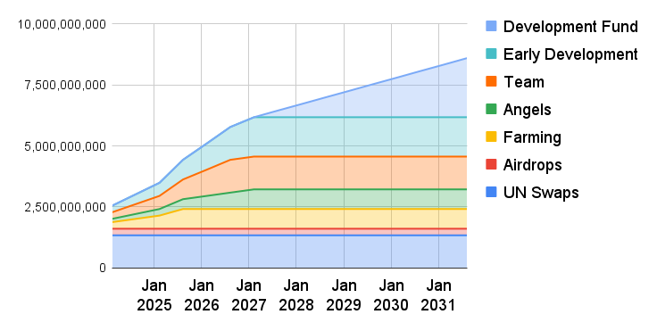

# UN Allocation

Most UN tokens will be managed by the community through UN Swaps, Airdrops, Farming, and the project’s short-term and long-term development funds; with only 25% given to Angels and the Team.

Total UN Supply: $$2^{33}=$$`8,589,934,592 UN`

| 
 
   |          **UN** |    **%** |
| ------------- | --------------: | -------: |
| **UN Swaps**  | `1,342,177,280` | `15.625` |
| **Airdrops**  |   `268,435,456` |  `3.125` |
| **Farming**   |   `805,306,368` |  `9.375` |
| **Angels**    |   `805,306,368` |  `9.375` |
| **Team**      | `1,342,177,280` | `15.625` |
| **Early Dev** | `1,610,612,736` | `18.750` |
| **Dev Fund**  | `2,415,919,104` | `28.125` |

<figure><picture><source srcset="../.gitbook/assets/chart (25).png" media="(prefers-color-scheme: dark)"></picture><figcaption>
UN Allocation
</figcaption></figure>

The Early Development and Development Funds will be allocated to the treasury of the UNIT project to launch Grants, Community Incentives, Protocol development, and other growth and development strategies.

UN tokens will be released from December 2023 to June 2031. The supply available is the following:

|                       |        Dec 2023 |        Dec 2024 |        Jun 2025 |        Dec 2025 |        Jun 2026 |        Dec 2026 |        Jun 2027 |        Dec 2027 |        Jun 2028 |        Dec 2028 |        Jun 2029 |        Dec 2029 |        Jun 2030 |        Dec 2030 |        Jun 2031 |
| --------------------- | --------------: | --------------: | --------------: | --------------: | --------------: | --------------: | --------------: | --------------: | --------------: | --------------: | --------------: | --------------: | --------------: | --------------: | --------------: |
| **UN Swaps**          | `1,342,177,280` | `1,342,177,280` | `1,342,177,280` | `1,342,177,280` | `1,342,177,280` | `1,342,177,280` | `1,342,177,280` | `1,342,177,280` | `1,342,177,280` | `1,342,177,280` | `1,342,177,280` | `1,342,177,280` | `1,342,177,280` | `1,342,177,280` | `1,342,177,280` |
| **Airdrops**          |   `268,435,456` |   `268,435,456` |   `268,435,456` |   `268,435,456` |   `268,435,456` |   `268,435,456` |   `268,435,456` |   `268,435,456` |   `268,435,456` |   `268,435,456` |   `268,435,456` |   `268,435,456` |   `268,435,456` |   `268,435,456` |   `268,435,456` |
| **Farming**           |   `268,435,456` |   `536,870,912` |   `805,306,368` |   `805,306,368` |   `805,306,368` |   `805,306,368` |   `805,306,368` |   `805,306,368` |   `805,306,368` |   `805,306,368` |   `805,306,368` |   `805,306,368` |   `805,306,368` |   `805,306,368` |   `805,306,368` |
| **Angels**            |   `134,217,728` |   `268,435,456` |   `402,653,184` |   `536,870,912` |   `671,088,640` |   `805,306,368` |   `805,306,368` |   `805,306,368` |   `805,306,368` |   `805,306,368` |   `805,306,368` |   `805,306,368` |   `805,306,368` |   `805,306,368` |   `805,306,368` |
| **Team**              |   `268,435,456` |   `536,870,912` |   `805,306,368` | `1,073,741,824` | `1,342,177,280` | `1,342,177,280` | `1,342,177,280` | `1,342,177,280` | `1,342,177,280` | `1,342,177,280` | `1,342,177,280` | `1,342,177,280` | `1,342,177,280` | `1,342,177,280` | `1,342,177,280` |
| **Early Development** |   `268,435,456` |   `536,870,912` |   `805,306,368` | `1,073,741,824` | `1,342,177,280` | `1,610,612,736` | `1,610,612,736` | `1,610,612,736` | `1,610,612,736` | `1,610,612,736` | `1,610,612,736` | `1,610,612,736` | `1,610,612,736` | `1,610,612,736` | `1,610,612,736` |
| **Development**       |                 |                 |                 |                 |                 |                 |   `268,435,456` |   `536,870,912` |   `805,306,368` | `1,073,741,824` | `1,342,177,280` | `1,610,612,736` | `1,879,048,192` | `2,147,483,648` | `2,415,919,104` |

<figure><picture><source srcset="../.gitbook/assets/allocationLight.png" media="(prefers-color-scheme: dark)"></picture><figcaption>
UN Release Schedule
</figcaption></figure>
